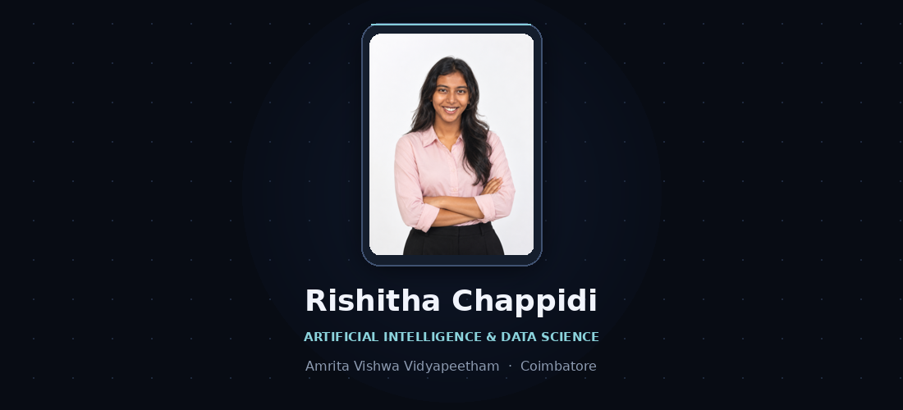
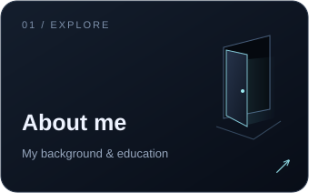
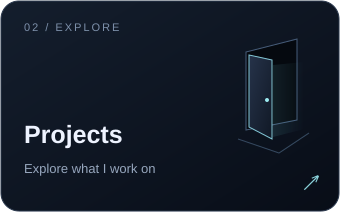
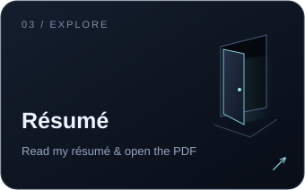
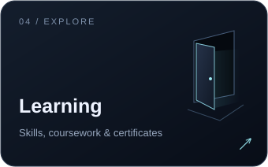
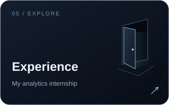
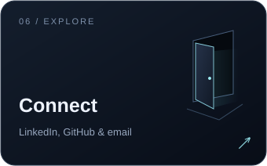

<b>Choose a door to explore.</b>

My background, projects, experience, and the things I'm learning.

<table>
<tr>
<td width="33%" align="center"> <a href="pages/about.md">Open About me →</a></td>
<td width="33%" align="center"> <a href="pages/projects.md">Open Projects →</a></td>
<td width="33%" align="center"> <a href="pages/resume.md">Open Résumé →</a></td>
</tr>
<tr>
<td width="33%" align="center"> <a href="pages/learning.md">Open Learning →</a></td>
<td width="33%" align="center"> <a href="pages/experience.md">Open Experience →</a></td>
<td width="33%" align="center"> <a href="pages/connect.md">Open Connect →</a></td>
</tr>
</table>

<a href="https://www.linkedin.com/in/rishitha-chappidi/">LinkedIn</a> · <a href="https://github.com/Rishithachappidi?tab=repositories">Repositories</a> · <a href="resume/Rishitha-Chappidi-Resume.pdf">Résumé PDF</a> · <a href="mailto:chappidirishithaa@gmail.com">Email</a>

# Rishitha Chappidi

Third-year **Artificial Intelligence and Data Science** student at **Amrita Vishwa Vidyapeetham**, with interests in machine learning, computer vision, robotics, data engineering, and software development.

This GitHub profile documents my academic work, research-oriented projects, team projects, and independent technical development.

## Connect

[LinkedIn](https://www.linkedin.com/in/rishitha-chappidi)

